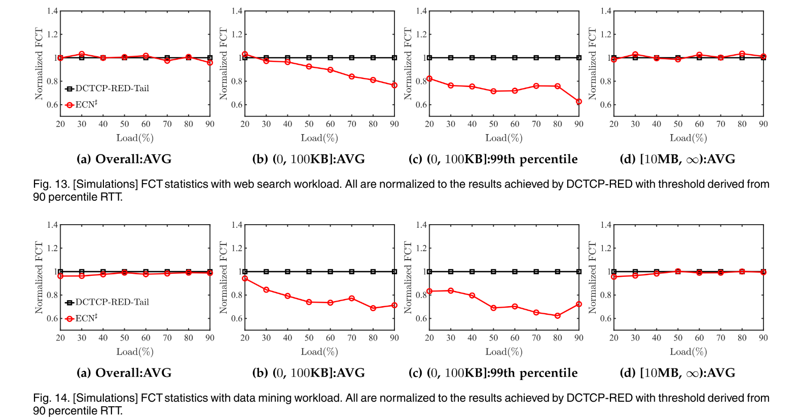
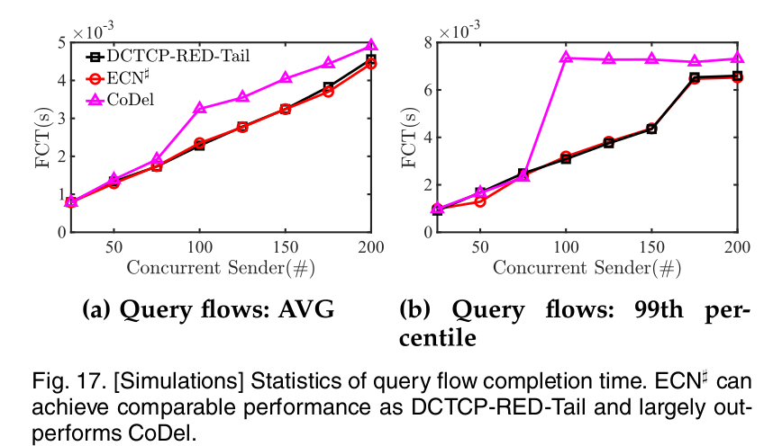
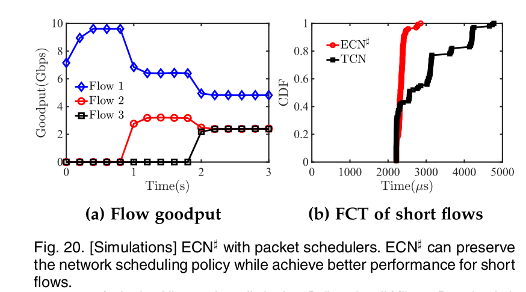
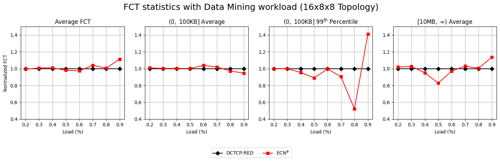
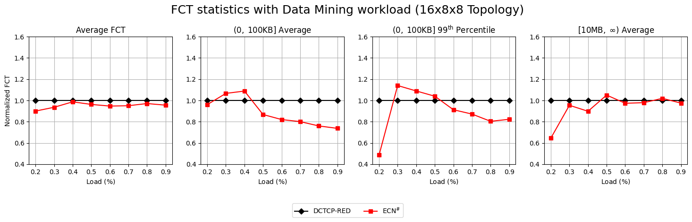
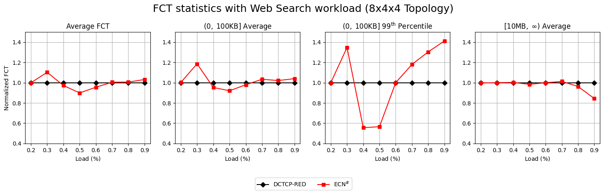
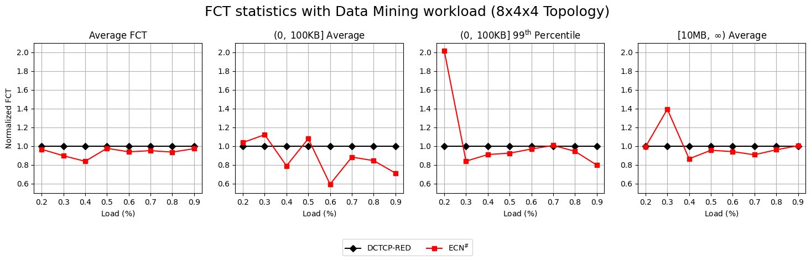
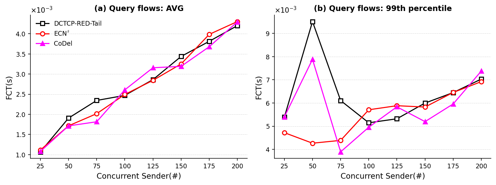
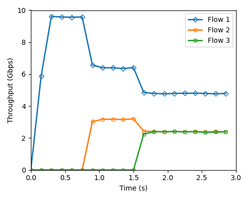
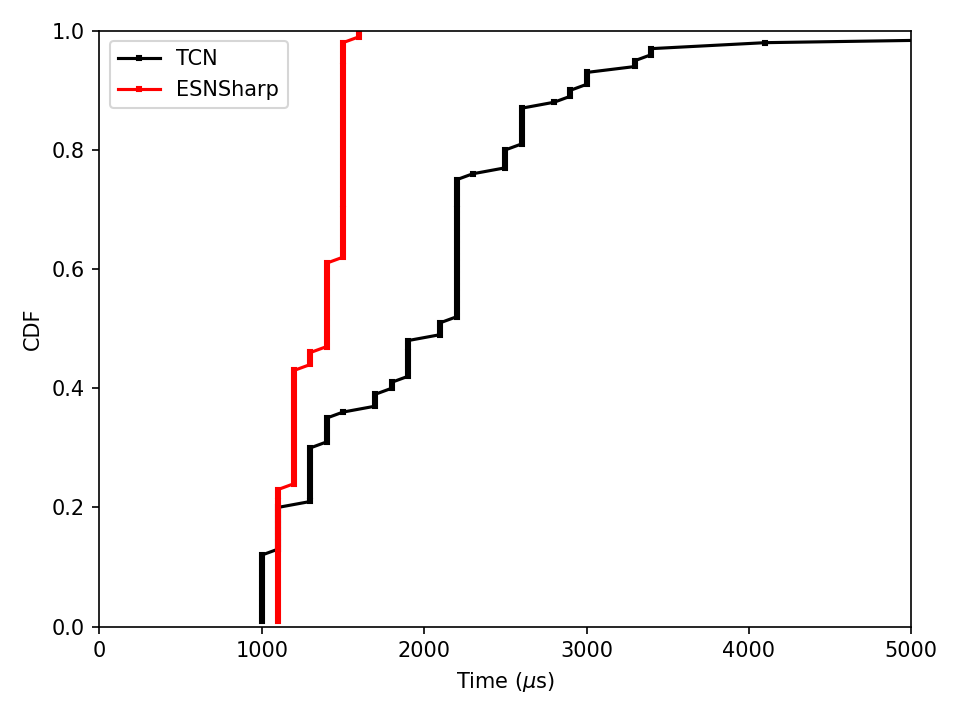

# Replicating: Enabling ECN for Datacenter Networks with RTT Variations

**Team Members:**  
Stanisław Ostyk-Narbutt (stanislaw.ostyknarbutt@mail.polimi.it);
Aldas Lenkšas (aldas.lenksas@mail.polimi.it);  
Leonardo Biason (leonardo.biason@mail.polimi.it)

---

**Source Paper:**
Junxue Zhang, Wei Bai, and Kai Chen. 2023. Enabling ECN for Datacenter Networks with RTT Variations. IEEE Transactions on Cloud Computing 11, No. 3 (July-September 2023), 2349–2364. IEEE, 16 pages. https://doi.org/10.1109/TCC.2022.3204988

<!-- Junxue Zhang, Wei Bai, and Kai Chen. 2019. Enabling ECN for Datacenter Networks with RTT Variations. In The 15th International Conference
on emerging Networking EXperiments and Technologies (CoNEXT ’19), December 9–12, 2019, Orlando, FL, USA. ACM, New York, NY, USA, 13 pages.
https://doi.org/10.1145/3359989.3365426 -->

**Project:**
All SLURM cluster scripts, Python plotting files, and modified ns-3 topology files are available in the following repo:
[github.com/ElBi21/NetworkComputing](github.com/ElBi21/NetworkComputing)

The project is organized in folders by figures recreated (e.g. `fig2` for Figure 2, etc.) and `fat-tree`, which contains the new extension we added to the paper.

---

# 1. Introduction

The base RTT (round-trip time) consists of transmission delay, propagation delay, and processing delay. As the first two are rather negligible inside datacenters, processing delay is the main contribution to RTT, which makes it vary significantly as flows traverse different components. ECN has been used in datacenters to deliver high throughput low latency communications. Having assumed a fixed RTT value, ECN performs an **instantaneous marking** based on such a value, but in practice, as shown in the paper, this leads to **performance degradation**: indeed, taking a low-percentile RTT value can result in throughput degradation, while a high-percentile RTT value can instead lead to an increased latency.

The authors of the paper have proposed a new solution that they named ECN#: it is based on the instantaneous ECN marking mechanism with the addition of marking packets when a persistent switch queue buildup is observed. This lightweight solution is able to handle bursts, maintain high throughput and eliminates unnecessary queueing delay. In order to detect the persistent queue buildup, the **sojourn time** (time in the queue for each packet) is measured and compared to the threshold. The marking is made conservatively, meaning that ECN# marks one packet in the interval, while only reducing threshold if the sojourn times continuously exceed the threshold.

The experiments to test the effectiveness of ECN# were conducted in a small but representative testbed, as well as with a larger scale leaf-spine topology network setup simulated in ns-3. As shown in the paper, ECN# achieves not only smaller average **Flow Completion Time** (FCT) for small flows, but it can also obtain a FCT similar to ECN's one for larger flows (Section 5.2 of the paper). Moreover, the proposed method keeps a lower queue occupancy compared to the other common practices (Section 5.4.1 of the paper).

# 2. Selected Result

<!-- Mention which result of the paper you are reproducing, and explain its importance.

For example:

> “Figure 1 shows that method A improves throughput by 35% over method B under workload *W*. This experiment shows that paper can effectively overcome the motivated challenge.”

<center>
  
  <p>Figure 1: The figure shows that method A improves throughput compared to method B</p>
</center> -->

We selected several of the most importants results to replicate. Below we introduce each result in its own subsection.

### Recreating Figure 2, 'Instantaneous Marking cannot achieve high throughput and low latency simultaneously`

The first result we chose to replicate is the core dilemma the paper discusses: instantaneous marking cannot achieve both low latency and high throughput simultaneously. This figure is shown before the authors introduce ECN#, and it sets the stage for why we need to add an additional mechanism for marking persistent flows. We found this result interesting since it's the entire motivation behind the paper. It demonstrates on a normalized graph and on a real testbed (not simulated) that as the marking threshold increases (i.e., the size of the queue in kilobytes above which we instantaneously mark packets with the congestion flag on), then throughput gradually increases; however, when throughput increases then the short flows (i.e., 99th percentile short flow) will become increasingly penalized, and latency will thus increase.

Specifically, if we increase the marking threshold from 50KB to 250KB, then the short flows would suffer from 119.2% increased flow completion time (581μs to 265μs) despite throughput having increased, for instance, by 8% just by increasing the marking threshold to 100KB. The core conclusion is that high throughput is a direct trade-off because it comes with high latency. This is precisely what ECN# attempts to solve.

<center>
  <div style="display:inline-block; width:50%; padding-left: 1em">
    
    <p>Figure 1: Original paper's Figure 2: Instantaneous marking cannot achieve high throughput and low latency simultaneously.</p>
  </div>
</center>

### Recreating the simulation on Leaf-Spine topology (Figures 13 and 14)

Section 5.3 proposes two simulation experiments that aim to measure the performance of ECN# against the one of DCTCP-RED. Each experiment focuses on a different network workload, while still keeping the same simulated topology. The results achieved by the authors can be found in Figures 13 and 14 in the paper (which are here reported):

<center>
  <div style="display:inline-block; width:90%; padding-left: 1em">
    
  </div>
</center>

### Recreating the experiments on the queue occupancy (Figure 16)

Section 5.4.1 of the paper introduces an experiment performed to measure and compare the queue occupancy of the different schemes. The results are presented in the Figure 16 of the paper:

<center>
  <div style="display:inline-block; width:90%; padding-left: 1em">
    
  </div>
</center>

The experiments measure the queue link of the bottleneck link for the 0.005 seconds duration starting at 4s mark with 100 concurrent flows happening, and a burst targeted at around the 4s mark. The results show that ECN# maintains lower queue occupancy (8 packets) compared to DCTCP-RED-Tail (182 packets). Moreover, ECN# achieves comparable results in handling bursty traffic when compared to DCTCP-RED-Tail and CoDel. ECN# has not dropped any packets, while CoDel dropped 125 packets during the burst.

### Recreating the experiments on bursty flows with different sender size (Figure 17)

Section 5.4.1 of the paper presents also a second experiment in which the number of concurrent query senders is changed from 25 to 200, and the query completion time is traced. The results are shown in the Figure 17 of the paper:

<center>
  <div style="display:inline-block; width:90%; padding-left: 1em">
    
  </div>
</center>

The CoDel experiences an FCT degradation once there are more than 100 concurrent senders, while ECN# keeps a similar performance to DCTCP-RED-Tail. Thus, ECN# is a good choice for control over a bursty traffic.

### Recreating the experiments with packer schedulers (Figure 20)

Section 5.4.3 compares ECN# with TCN in order to show how ECN# works with arbitrary packet scheduler. The switch is configured to Deficit Weighted Round Robin (DWRR) with 3 queues and their weights following the ratio 2 : 1 : 1. From each of the sender a long-lived TCP flow is created and classified into the corresponding queue, while the rest of the senders randomly start short flows. The results are presented in the following figure:

<center>
  <div style="display:inline-block; width:90%; padding-left: 1em">
    
  </div>
</center>

The paper observes that at the beginning only the queue 1 is active with the goodput achieved of 9.6 Gbps per second. Once flow 2 starts, queue 2 also becomes active and flow 1 achieves 6.42 Gbps goodput. Finally, when all three flows are started, the achieved goodputs per flows are 4.82Gbps, 2.40Gbps and 2.40Gbps. The short flow FCT among all queues is also measured and presented in the Figure 20b. The results in the paper mention that ECN# achieves 19.6% better average FCT for short flows than TCN.

# 3. Environment Setup

First, we introduce the common environment setup for all experiments; after, we will introduce additional details for the environment setup for each recreated figure. 

### Common Environment Setup

We used the provided ns-3 simulation code from the repository of the authors at [https://github.com/snowzjx/ns-3-ecn-sharp/tree/master](https://github.com/snowzjx/ns-3-ecn-sharp/tree/master). 

Specifically, we use their preconfigured Docker image for simplicity. Following the authors' README, these are the exact commands to recreate the setup:

```bash
# First, pull and run the authors' preconfigured Docker container
docker run -it snowzjx/ns-3-ecn-sharp:optimized

# Once inside, navigate to the code repo
cd ~/ns-3-ecn-sharp

# We configure the project either to debug mode with -d debug or to optimized mode:
./waf -d optimized --enable-examples configure

# Then we compile the ns-3 simulator
./waf
```

<!-- *Note:* This section should contain enough information to allow someone else to
reproduce *your* report. Share hardware and/or software setup relevant to your
experiment. For example:

**Hardware Environment:**
CPU, Memory, Storage, Network, Cloud / local / cluster, Any relevant micro-architectural details

**Software Environment**
OS version, Kernel version, Compiler version, Libraries, Dependencies, Paper artifact used (Yes/No; version/commit hash)

**Configuration Parameters:**

- Workload configuration
- Dataset
- Runtime parameters and flags

**Deviations from the Original Setup:**

Clearly describe any difference between papers and your experiment environment.

- Hardware differences
- Software version differences
- Dataset substitutions
- Unavailable components

Explain why these deviations were necessary.

If something was **missing in the original paper**, state it. For example:

> The paper does not specify X. We assumed Y (or explored range *a* to *b*). -->

### Recreating Figure 2, 'Instantaneous Marking cannot achieve high throughput and low latency simultaneously`

The authors conducted the experiment of Figure 2 on a real-hardware testbed: such testbed consists of 8 hosts connected with 10 Gbps Ethernet adapters and a Mellanox SN2100 switch. The links' speed is 10Gbps, and they generate a continuous load of 50% with $3\times$ RTT variations (i.e., they vary from 70μs to 210μs). Although not clearly stated, the authors used the same web workload using their previous experiment's Apache web server and `ApacheBench` for generating 3000 HTTP requests. 

We noticed a big inconsistency in the paper, which is that all the 'core arguments' for why we need ECN# are based on their physical testbed, which is ultimately a small network, but all their ECN# experimentation is based on a simulated large-scale 128-server leaf-spine network. So we decided to recreate Figure 2 with the simulated ns-3 leaf-spine topology. However, we still kept many of the other settings as much as possible the same. 

We also used web search workloads using the DcTCP CFD file based on [1] (same as the authors in their later experiments). We also used a bottleneck load of 50% by using the predefined `--load` parameter to 0.5 in their ns-3 large-scale topology setup. However, there were still a lot of other parameters we had to fine-tune ourselves: specifically, simulation time (both total simulation time and the time at which new flows stop being generated) and topology configuration (how many spines, leaves, and servers per leaf). We experimented across different topologies, and found that with larger topologies it was much harder to reach a congestive state, and therefore, hard to replicate their results. We had several failed attempts with graphs that demonstrate We ultimately settled on a topology as close to the testbed they used without the classical leaf-spine architecture by effectively using an as-close setup as possible: we used 1 spine, 2 leaves, and 4 servers per leaf, with 10Gbps links between each. Note that this aims to closely emulate their setup of 8 hosts, but it's fundamentally different: the authors used just one switch over for making the hosts communicate, while we used two leaf nodes and a spine, but also 8 total hosts communicating. In these similar yet slightly more complex topologies, we achieved convincing results.

We used TCN in the simulator for instantaneous marking, but this took as a parameter the sojourn time rather than a threshold in KB representing the size of the queue. To convert this, we used as assumption the fact that we can use the link speed (set to 10Gbps) to convert these numbers (first bit to byte, then from giga to kilo), thus obtaining the following mapping from the threshold in KB to the threshold in μs: `(50 100 150 200 250 300)` $\rightarrow$ `(40 80 120 160 200 240)`.

These were however difficult to emulate, but we discovered after many attempts that the difficulty lied in the right tuning of the simulation time. We increased it from the default 0.5 seconds to 4 seconds, with new flows stopping at 3 seconds. This however made the simulations hard to run in local, so we decided to run the simulation on the Galileo100 cluster through Apptainer (as wrapper of Docker). The simulations were launched with a Slurm script, which is provided in our repository under the `fig2` folder, together with all the used files for this experiment to ensure full reproducibility of our methodology.

### Recreating experiments on Leaf-Spine topology (Figures 13 and 14)

In order to simulate the Leaf-Spine topology, we used the ns-3 simulator provided by the authors of the paper in their GitHub repository. The simulation can be started with:

```bash
./waf --run "large-scale \
    --randomSeed=233 \
    --load=[0.2, 0.9] \
    --ID=LargeScale \
    --AQM=[TCN|ECNSharp] \
    --ECNShaprInterval=70 \
    --ECNSharpTarget=10 \
    --ECNShaprMarkingThreshold=70"
```

where the parameters that should be changed are the load (which must be a value in the range $[0.2, \; 0.9]$) and the AQM. In this case, TCN corresponds to DCTCP-RED (as explained by the authors, in presence of one single queue TCN behaves just like DCTCP-RED).

The default topology present in the repository considers 8 servers per leaf switch, 4 leaf switches and 4 spine switches, although in the paper a different topology is mentioned (16 servers per leaf, 8 leaf switches and 8 spine switches). We have explored both topologies, and compared the obtained results. The ECN# specific values are recovered from the repository, as in the paper few details were given.

### Recreating experiments on the queue occupancy (Figure 16)

The results on the queue occupancy correspond to Section 5.4.1 and Figure 16 in the paper.

The code provided by authors includes the executable `queue-track` to be ran for this experiment. The code creates all the required setup: the background flows are installed and incast flows, consistent with "100 concurrent query flows" description. However, not all values are the same in paper as in the code's default values. To be more precise, the `bufferSize` seems to be 600 based on the plot rather than 100 which is the default value. The code also expects `endTime` and `simulationEndTime` which are not described in the paper. Knowing that we want to have the burst in the timespan between 4.000 seconds and 4.005 seconds, the good values turned out to be `endTime=4.5` and `simulationEndTime=5.0`, as these produce a burst around the 4s mark. The thresholds were also not described, so we have chosen them to what seemed a reasonable choise and representative to the results in the paper. The actual values used are mentioned below in Section 4. Experiment Result.

### Recreating the experiments on bursty flows with different sender size (Figure 17)

This corresponds to Section 5.4.1 and Figure 17 of the paper. 

As barely any details are presented in the paper, we had to assume that mostly the default values of the `queue-track` are used. The important value to change is the number of concurrent senders, which is changed from 25 to 200 in the steps of 25, as can be seen in the Figure 17 of the paper.

### Recreating the experiments with packer schedulers (Figure 20)

This corresponds to Section 5.4.3 of the paper. We have used the multiqueue executable `mq` to run the experiments, as the defautl setup highly corresponds with the experiment description in the paper. Most importantly, the three queues are started and the weights are given with the ratio 2:1:1, as can be seen in the following snippet:

```C++
    dwrrQdisc->AddDWRRClass (queueDisc1, 0, 3000);
    dwrrQdisc->AddDWRRClass (queueDisc2, 1, 1500);
    dwrrQdisc->AddDWRRClass (queueDisc3, 2, 1500);
```

The other values have been left as the default ones.

# 4. Experiment Result

We replicated several of the results of the paper in order to assess its various claims about ECN#'s performance. Each is documented below.

### Recreating 'Instantaneous Marking cannot achieve high throughput and low latency simultaneously` (Figure 2)

The simulation was made by running the `job.sh` script (through SLURM) provided in our repository under the `fig2` folder with the exact methodology described in the previous section. In order to get the right results we performed much parameters fine-tuning: specifically, we ran on the Galileo100 cluster a script that varied `seed` across `(233 234 235)` and `threshold` across `(40 80 120 160 200 300)` with the following parameters: 

```bash
./waf --run "large-scale \
    --randomSeed=${seed} \
    --load=0.5 \
    --ID=${id} \
    --AQM=TCN \
    --TCNThreshold=${threshold} \
    --leafCount=2 \
    --spineCount=1 \
    --serverCount=4 \
    --EndTime=4 \
    --FlowLaunchEndTime=3"
```

This simulation achieved the following results:

<center>
  <div style="display:inline-block; width:90%; padding-left: 1em">
    
    <p>Figure 1: Our reproduction of Figure 2 on the simulated ns-3 large-scale setup</p>
  </div>
</center>

Although there is a clear difference between the replicated Figure 2 and the paper's original, we believe this mainly stems from the topology difference, as ours is simulated while theirs is on a real testbed. Nonetheless, we actually derive a similar overall trend: the 99th percentile is heavily penalized as we increase the marking threshold. The most important difference was that no matter how we configured our experiment, we could not get the average FCT to decrease as the marking threshold to increase (i.e., reach a higher throughput): in our results, it always gradually increased. We concluded that it must be because our topology is less congested, since we have more routes than the original testbed, and therefore we do not see a throughput increase with a higher threshold, as there is not a single simple bottleneck as in the original paper. Our conclusion remains nonetheless the same: ECN penalizes latency as we increase the threshold. 

### Recreating the simulation on Leaf-Spine topology (Figures 13 and 14)

In order to prove the efficiency of ECN#, the authors of the paper simulated two different kinds of workloads and subjected ECN# to it. Specifically, the simulations were carried out in two different settings: a *testbed* and a *large scale* setting. We will focus on the reproduction of the simulations under the large scale setting only, as it was the only one reproducible through a simulator. The two workloads proposed by the authors are called **web search** and **data mining**: the first is characterized by small, bursty flows, while the second is mainly composed of long and steady flows.

As per the original paper, the topology is based on the Leaf-Spine model, and in our case it counts 8 spine switches, 8 leaf switches and 128 total servers (16 per leaf switch). This topology will be referred to as `16x8x8`.

The comparison focuses explicitely on the performances of ECN# in contrast to the ones of DCTCP-RED, hence the reason why the authors reported the normalized FCT in the plots. The original results achieved by the authors can be observed in Figures 13 and 14 in the original paper. Here below are shown the results obtained from our simulations with the **web search** workload:

<center>
  <div style="display: inline-block; width: 100%">
    
    <p>Figure 2: FCT results for the web search workload</p>
  </div>
</center>

With respect to the original measurements, the average FCT and the 99th percentile keep a similar behaviour; the $(0, \; 100\text{kB}]$ average instead starts showing improvements over DCTCP-RED with a load of more than 80%. The only measurement that appears to be completely different is the average for flows of size $[10\text{mB}, \; \infty)$: standing by the paper, ECN# and DCTCP-RED should perform very similarly, but in our case the simulation shows a less consistent behaviour, with worse performances as the load increases. These simulations have been repeated with different seeds to test if the shown behaviour was repeated over runs with different seeds or not, but the results kept having similar trends, especially the spikes that can be seen in the $(0, \; 100\text{kB}]$ 99th percentile plot.

The situation changes with the **data mining** workload:

<center>
  <div style="display: inline-block; width: 100%">
    
    <p>Figure 3: FCT results for the data mining workload</p>
  </div>
</center>

By comparing such results with the ones shown in the paper, we see a closer resemblance: except for a couple spikes in the $(0, \; 100\text{kB}]$ average and $(0, \; 100\text{kB}]$ 99th percentile, the behaviour is consistent. The performances for the average FCT show that ECN# takes on average $0.95\times$ less time than DCTCP-RED; in the $(0, \; 100\text{kB}]$ and $[10\text{mB}, \; \infty)$, as the load approaces $100\%$, we see that ECN# achieves better performances overall, diverging from DCTCP-RED.

All of such results have been obtained with the Leaf-Spine topology described in the paper, but we wanted to explore how ECN# would perform in the topology proposed in the GitHub repository of the authors: indeed, the simulator's default topology requires 8 servers per leaf switch, 4 leaf switches and 4 spine switches. This topology will be labeled as `8x4x4`. After running the simulations with the new topology, we obtained the following results:

<center>
  <div style="display: inline-block; width: 100%">
    
    
    <p>Figure 4: FCT results for the web search (up) and data mining workload (below) on the 8x4x4 topology</p>
  </div>
</center>

We can notice how ECN# behaves in a more stable way with high throughput flows, while it struggles to keep a steady performance with bursty flows. Also, notice how the results for each workload in this topology greatly differs from the ones in the `16x8x8` topology: for the smaller topology there is much more instability, and no clear convergence/divergence (except for a few cases).

### Recreating the experiment on the queue occupancy (Figure 16)

To run the experiment, the `queue-track` tool was ran with the following configurations, each for different scheme:

```bash
# ECN#
./waf --run "queue-track \
  --id=test \
  --AQM=ECNSharp \
  --transportProt=DcTcp \
  --numOfSenders=100 \
  --bufferSize=600 \
  --endTime=4.5 \
  --simEndTime=5.0 \
  --ECNSharpInterval=150 \
  --ECNSharpTarget=10 \
  --ECNSharpMarkingThreshold=20 \
  --load=0.9 \
  --flowNum=1000"

# CoDel
./waf --run "queue-track \
  --id=test \
  --AQM=CODEL \
  --transportProt=DcTcp \
  --numOfSenders=100 \
  --bufferSize=600 \
  --CODELInterval=150 \
  --CODELTarget=10 \
  --endTime=4.5 \
  --simEndTime=5.0 \
  --load=0.9 \
  --flowNum=1000"

# DCTCP-RED-Tail
./waf --run "queue-track \
  --id=test \
  --AQM=RED \
  --transportProt=DcTcp \
  --numOfSenders=100 \
  --bufferSize=600 \
  --REDMarkingThreshold=40 \
  --endTime=4.5 \
  --simEndTime=5.0 \
  --load=0.9 \
  --flowNum=1000"
```

The results are as presented in the figure below:

<center>
  <div style="display:inline-block; width:95%; padding-left: 1em">
    
    
    
    <p>Figure 5: Our reproduction of Figure 16. The experiment measured the queue occupancy during different schemes in a short window of 0.005 seconds during a flow burst.</p>
  </div>
</center>

The exact lines and values are not neccesarily the same as in the paper, possibly due to small differences in the configuration. However, the patterns are still clear and match the results from the paper. DCTCP-RED-Tail reaches the maximum queue occupancy of 416 packets, CoDel reaches the buffer limit of 600 packets, while ECN# reaches only 318 packets. This replicates the results that no packets are dropped when handling burst with ECN#. However, one inconsistency is that in the paper DCTCP-RED-Tail obtains the queue occupancy of 182 packets overall, while in our experiment it gets lower and close to zero after the burst. This can be explained in the possible difference of the simulation time configuration or the difference in the burst or background traffic generation, which is not fully explained in the paper.

### Recreating the experiments on bursty flows with different sender size (Figure 17)

We used `queue-track` as the main tool. The bash script that was used to sweep over the different schemes and different number of the concurrent senders is present in `ecnsharp-fig-17/run_fct_sweep.sh`. The resulting graph is as follows:

<center>
  <div style="display:inline-block; width:90%; padding-left: 1em">
    
    <p>Figure 6: Our reproduction of Figure 17. The experiment measured the flow completion time during burst traffic with different number of concurrent senders.</p>
  </div>
</center>

As it can be seen, our reproduced results are totally different. The average FCT seems to be rather similar for all schemes, while 99th percentile obtains a jump at the beginning  and then proceeds to increase similarly for all schemes.

There are several reasons for that, all arrising from a possible mismatch in the configuration, as the details are not presented in the paper. When running the simulation, background noise traffic has been generated and the overall simulation end time was set to 5s, while the actual experiment could have been run with completely different values. Moreover, the thresholds (RED marking threshold, ECN# marking threshold, etc.) were used as the default ones from the code, while there is a chance that the authors have used a different setup values. Lastly, the shape of the 99th percentile results that we have obtained indicates a clear issue, arrising either from the inclusion of the background flows or from the fact that authors might have run the simulation several times with different seeds and averaged the results. We have run our experiment only once, as already running it for a short simulation period over all possible combinations for one plot took more than 4 hours.

To conclude, we suspect that the results for this figure could not be reproduced easily by the lack of the experiment configuration details in the paper and the computation constraints on our side.

### Recreating the experiments with packer schedulers (Figure 20)

After running the experiment with `mq` executable and parsing the results, the following results have been achieved:

<center>
  <div style="display:inline-block; width:90%; padding-left: 1em">
    
    
    <p>Figure 7: Our reproduction of Figure 20. The experiment measured and compared ECN# with TCN when using an arbitrary packet scheduler.</p>
  </div>
</center>

The results match the ones from the paper. To be more precise, the flow throughputs match the Figure 20a, and the FCT of short flows get a similar cummulative distribution function as in the paper. The only caveat is that the paper measure goodput, whereas in our experiment we have used throughput to plot. However, goodput is just only slightly smaller, and the trend would be very similar. Because of this, we have decided to stick with the throughput for our calculations for simplicity.

# 5. Further Exploration

<!-- 
In this project you are required to also explore a research question of your own. Either:

1. Take the same test with different input workload or a variation of a test that is not present in the paper and comment the results you obtain
1. Implement a new feature on top of the system you evaluated and show a figure showing the performance

Discuss which approach you take, and what you explored. Explain what was your
motivation and importance of your question. -->

As extension, we wanted to test the effectiveness of ns-3 on a new topology. The paper only demonstrates its effectiveness on a Leaf-Spine two-tier network topology with 128 servers, and we wondered if a different topology would show similar trends. In particular, we wanted to explore how ECN# would perform in Fat Trees networks because their three-tier architecture would add complexity to the topology and provide more possible flow paths. 

This is an important question to ask, because topologies can drastically change the available routes that flows can take and possibly increase RTT variations; this becomes especially relevant with the Fat Tree topology, which is very common in real-life datacenters. We also wondered if we would see the same trends as in their figures, specifically for average FCT and for the 99th percentile FCT. In order to check its effectiveness, we compared ECN# to DcTCP-RED (which is equivalent to TCN since we use one queue, as explicitly stated by the authors in their paper).

The GitHub repositorry contains also the topology definition for ns-3, which is in `examples/rtt-variations/large-scale.cc`. We began by defining the configuration for a Fat-Tree topology, choosing $K = 4$ as the default value, but allowing it to be modified through launch argument.

```C
int K = 4;

if (K < 2 || K % 2 != 0)
  {
    NS_LOG_ERROR ("Fat-tree K must be even and at least 2");
    return 0;
  }

const int POD_COUNT = K;
const int EDGE_PER_POD = K / 2;
const int AGG_PER_POD = K / 2;
const int CORE_GROUPS = K / 2;
const int CORE_PER_GROUP = K / 2;
const int CORE_COUNT = CORE_GROUPS * CORE_PER_GROUP;
const int EDGE_COUNT = POD_COUNT * EDGE_PER_POD;
const int AGG_COUNT = POD_COUNT * AGG_PER_POD;
const int SERVER_PER_EDGE = K / 2;
const int TOTAL_SERVER_COUNT = EDGE_COUNT * SERVER_PER_EDGE;

// ...

// Here K was added as a command-line parameter for ease of changing it during experimentation
cmd.AddValue ("K", "Fat-tree k parameter. Must be even and at least 2", K);
```

We tried changing as little as possible from the previous code to adapt it to the new one: we wanted to make this simulation more similar to the one defined by the paper's authors. We defined our ns-3 containers and installed them using `internet.Install (...)`:

```C
NodeContainer core;
core.Create (CORE_COUNT);
NodeContainer aggregation;
aggregation.Create (AGG_COUNT);
NodeContainer edge;
edge.Create (EDGE_COUNT);
NodeContainer servers;
servers.Create (TOTAL_SERVER_COUNT);
```

Generating the links was quite challenging: since we didn't have much expertise with ns-3, we used the help of generative AI tools to define the `for` loop that creates the links (i.e., server <--> edge, edge <--> aggregation, aggregation <--> core). We want to be transparent about this, as we believe that this is a fair usage of AI which only aided through the course of the experiment, leaving to us the responsibility of decision-making and the creative input.

Lastly, we replaced the `large-scale.cc` file with the Fat-Tree topology implementation, which is available under the `fat-tree` folder of our repository. The simulation was ran on CINECA's Galileo100 cluster through an Apptainer container. We modified our SLURM script from Figure 2 to instead vary load instead of threshold, since we wanted to recreate Figure 9-style plots from the paper (which were done on large-scale testing of the Leaf-Spine topology, 128 servers).

## 5.1. Methodology and Result

<!-- Report the experiment you designed for answering the question and share the
result you got.

Include:

- Graph(s) or table(s)
- How the experiment was conducted (share the details)
- What did you discover? -->
We simulated the Fat-Tree topology with $K = 4$ because larger values would take an extremely large amount of time to complete. Our experiment used the same $3 \times$ RTT variations as in the authors' original large-scale test setup (other than the topology, we changed as little as possible).

For the no ECN# version, we used TCN, which is equivalent to DcTcp-RED with one queue, according to the paper. This experiment was run across loads $0.1$ to $0.9$ with increments of $0.1$ (a bit more than the paper's $0.2$ to $0.9$ in Figure 9). We ran it over only one seed (233), because this simulation took over three hours to run. Even by running it overnight, we did not want to abuse our cluster access (as it's shared with other colleagues), making this a limitation of our experiment. Ideally, we would have run it over three seeds and averaged. We used the optimal marking threshold recommended by the paper, which was 250KB, and by our mapping, therefore 200ms.

```bash
./waf --run "large-scale \
    --randomSeed=${seed} \
    --load=${load} \
    --ID=${id} \
    --AQM=TCN \
    --TCNThreshold=200 \
    --K=4 \
    --EndTime=1 \
    --FlowLaunchEndTime=0.5"
```

For the version using ECN#, we used the suggested optimal parameters according to the paper which are based on the 90th percentile RTT, set as follows:

```bash
./waf --run "large-scale \
    --randomSeed=${seed} \
    --load=${threshold} \
    --ID=${id} \
    --AQM=TCN \
    --ECNShaprInterval=200 \
    --ECNSharpTarget=85 \
    --ECNShaprInterval=200
    --K=4 \
    --EndTime=1 \
    --FlowLaunchEndTime=0.5"
``` 

The results are here shown:

<center>
  <div style="display:inline-block; width:90%; padding-left: 1em">
    
    <p>Figure 8: ECN# vs TCN Performance Comparison on Fat Tree with K=4</p>
  </div>
</center>

As we can see, ECN# is still able to outperform DCTCP-RED. This is more evident in the average FCT, while the 99th percentile is not as clear, and certainly less of a gap than in the paper's short flow difference shown, for example, in Figure 9b, which looks at the average short flow completion time difference. We believe this is because our simulation ran for only 1 simlated second and only over one seed, so the short flow behaviour is not very representative of short flows in larger systems ($K \gt 4$) or than simulations ran on larger simulation times (ideally $\gt 4s$) for more trials over more seeds averaged out. Nonetheless, we are able to see the effectiveness of ECN#, since even over such a short simulation period it is able to achieve both better overall average flow completion time and 99th percentile short flow. This demonstrates how ECN# has achieved both throughput and latency improvements, even if at this small scale they are marginal. A possible future experiment would be to run a much larger simulation with higher values of $K$ and for larger amounts of time. 

# 6. Reproducibility Assessment of the Paper

<!-- Evaluate the paper itself:

- Was the methodology clearly described?
- Was the artifact usable?
- How difficult was reproduction? -->

Part of the paper was very well documented and reproducible, as the authors provide a Docker image with the preconfigured ns-3 simulation to run certain experiments. However, this only pertains to the large-scale testing they did. All earlier graphs, including Figure 2 as an example, required us to experiment with ns-3 ourselves in order to try to replicate. The code itself was well written, although it did contain some typos even in the command line interface. Some parameters were not explicitly stated, and were instead recovered from the simulations' default values. However, after recreating especially the Leaf-Spine topology, we have the doubt that the standard parameters were the correct ones (for instance, the default topology is not coherent with the one defined in the paper). Overall, the authors did a good job of ensuring reproducibility. 

# 7. Conclusion

This project allowed us to better understand how congestion control works and how even simple ideas (like to have a dynamic threshold for packet marking) can be effective in both very complicated and relatively simple networks. We learned how to reproduce the results of an academic experiment, and realized the importance of making science accessible and reproducible. As technical skills, we learned some basics of ns-3 and how to recreate some topologies.

---

<!-- # Appendix

You are asked to write this report using Markdown. You can find a cheat sheet
of Markdown syntax at this [link](https://rust-lang.github.io/mdBook/format/markdown.html).

For generating a PDF file from your report you can use a tool of your choice.
*md2pdf* is one such tool. See this [link](https://pypi.org/project/md2pdf/)
for more information about it. You can also use an online editor such as [this](https://www.md2pdf.io/). -->

[1] Mohammad Alizadeh, Albert Greenberg, David A. Maltz, Jitendra Padhye,
Parveen Patel, Balaji Prabhakar, Sudipta Sengupta, and Murari Sridharan. 2010.
Data Center TCP (DCTCP). In SIGCOMM 2010.
