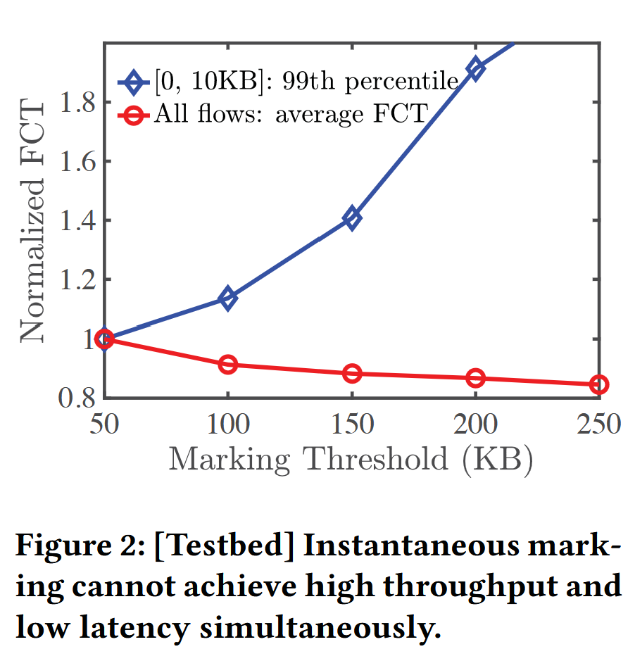
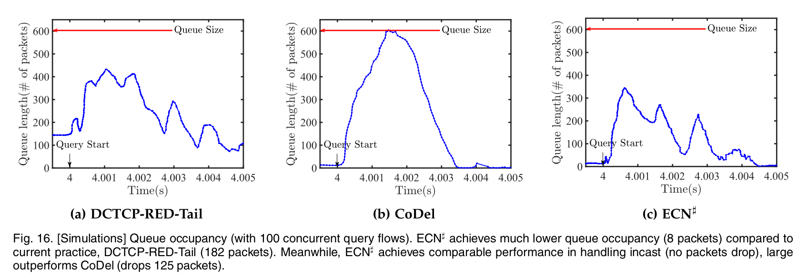
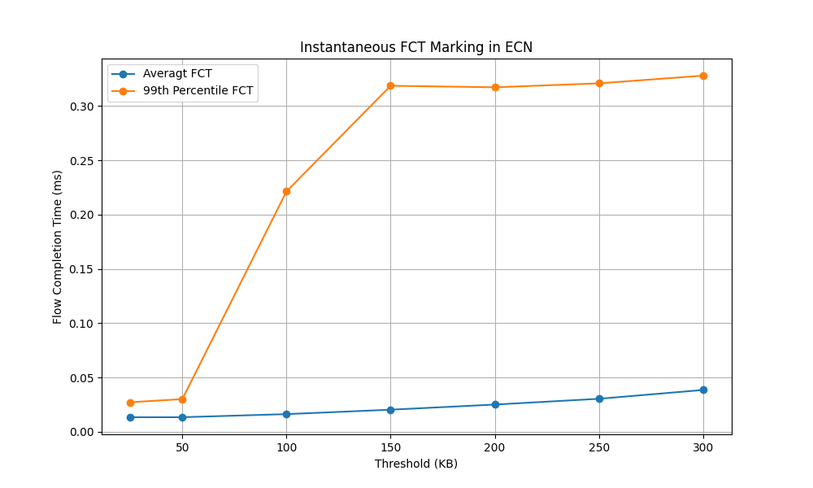
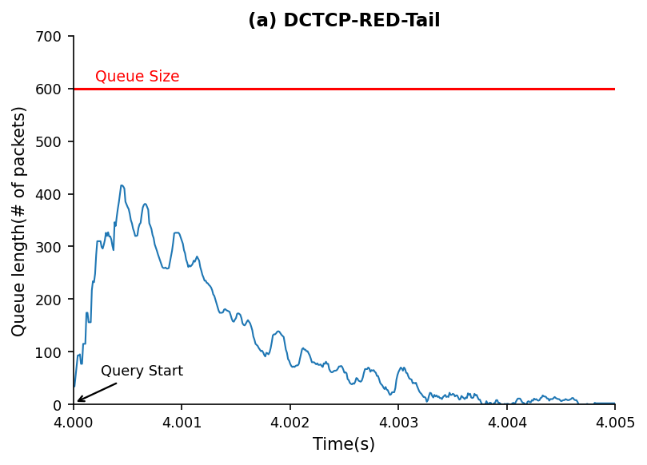
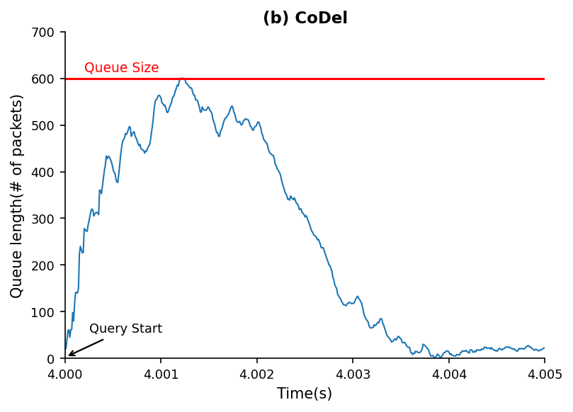
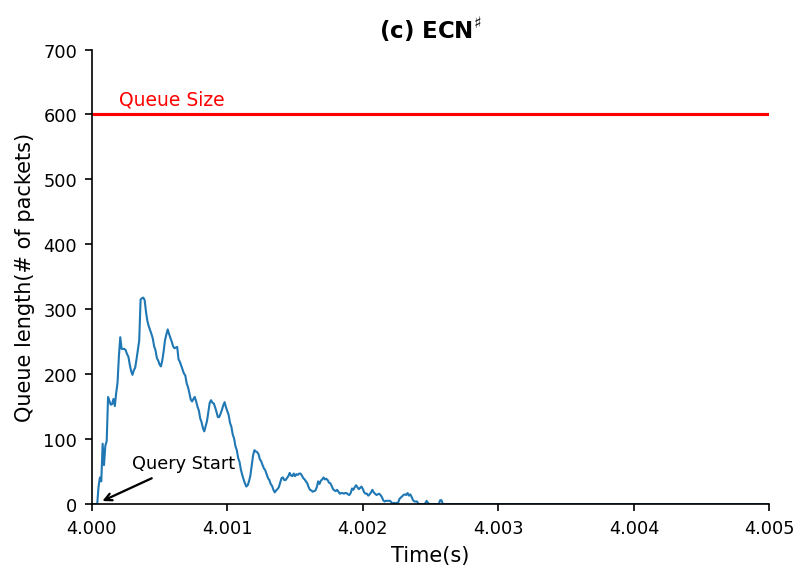
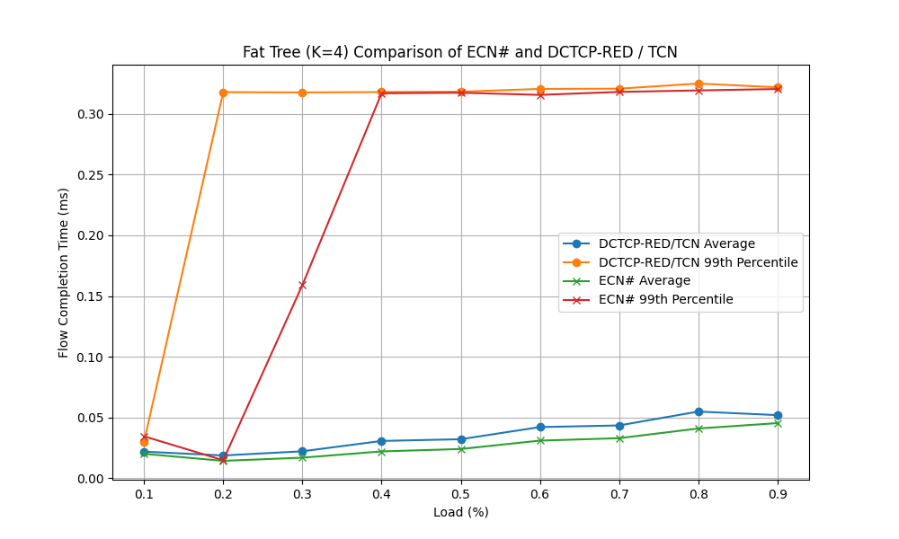

# Replicating: Enabling ECN for Datacenter Networks with RTT Variations

**Team Members:**  
Stanisław Ostyk-Narbutt (stanislaw.ostyknarbutt@mail.polimi.it);
Aldas Lenkšas (aldas.lenksas@mail.polimi.it);  
FirstName LastName3 (email address)

---

**Source Paper:**
Junxue Zhang, Wei Bai, and Kai Chen. 2023. Enabling ECN for Datacenter Networks with RTT Variations. IEEE Transactions on Cloud Computing 11, No. 3 (July-September 2023), 2349–2364. IEEE, 16 pages. https://doi.org/10.1109/TCC.2022.3204988

<!-- Junxue Zhang, Wei Bai, and Kai Chen. 2019. Enabling ECN for Datacenter Networks with RTT Variations. In The 15th International Conference
on emerging Networking EXperiments and Technologies (CoNEXT ’19), December 9–12, 2019, Orlando, FL, USA. ACM, New York, NY, USA, 13 pages.
https://doi.org/10.1145/3359989.3365426 -->

**Project:**
All slurm cluster scripts, python plotting files, and modified NS3 topology files are in the following repo:
[github.com/ElBi21/NetworkComputing](github.com/ElBi21/NetworkComputing)

It is organized in folders by figure recreated (e.g. `fig2` for Figure 2, etc.) and `fat-tree` contains the new extension we added to the paper.

---

# 1. Introduction

<!-- Introduce the paper by summarizing:

- The problem the paper addresses and its importance
- The key ideas behind its solution and its approach
- The main contributions -->

The base RTT (round-trip time) consists of transmission delay, propagation delay, and processing delay. As the first two are rather negligible inside datacenters, processing delay is the main contribution to the RTT, which makes it vary significantly, as flows traverse different components. ECN has been used in datacenters to deliver high throughput low latency communications. Having assumed a fixed RTT value, ECN performs an instantaneous marking based on such a value. In practice, as shown in the paper, this leads to performance degradation. Taking a low-percentile RTT value results in throughput degradation, while a high-percentile RTT value can lead to an increased latency.

Authors have proposed a new solution that they named ECN#. It is based on the instantaneous ECN marking with an addition of marking packets when a persistent switch queue buildup is observed. This lightweight solution is able to handle bursts, maintain high throughput and eliminates unnecessary queueing delay. In order to detect the persistent queue buildup, the sojourn time (time in the queue for each packet) is measured and compared to the threshold. The marking is made conservatively, meaning that ECN# marks one packet in the interval, while only reducing threshold if the sojourn times continuously exceed the threshold.

The experiments were done in a small but representable testbed, as well as with a larger scale network setup simulated in NS3. As shown in the paper, ECN# achieves smaller average FCT (Flow Completion Time) for small flows while achieving a similar FCT for larger flows (Section 5.2 of the paper). Moreover, the proposed method keeps a lower queue occupancy compared to the other common practices (Section 5.4.1 of the paper).

# 2. Selected Result

<!-- Mention which result of the paper you are reproducing, and explain its importance.

For example:

> “Figure 1 shows that method A improves throughput by 35% over method B under workload *W*. This experiment shows that paper can effectively overcome the motivated challenge.”

<center>
  
  <p>Figure 1: The figure shows that method A improves throughput compared to method B</p>
</center> -->
We selected several of the most importants results to replicate. Below we introduce each result in its own subsection.

### Recreating Figure 2, 'Instantaneous Marking cannot achieve high throughput and low latency simultaneously`
The first result we chose to replicate is the core dilemma the paper discusses: instantaneous marking cannot achieve both low latency and high throughput simultaneously. This figure is before the authors introduce ECN#, and it sort of sets the stage for why we need to add an additional mechanism for marking persistent flows. We found this result interesting since it's the entire motivation behind the paper. It demonstrates on a normalized graph and on a real testbed (not simulated) that as the marking threshold increases (i.e., the size of the queue in kilobytes above which we instantaneously mark packets with the congestion flag on), we see that throughput gradually declines, thus throughput increases while the short flows, i.e., 99th percentile short flow, become increasingly penalized and thus latency increases too. Specifically, when we increase the marking threshold from 50KB to 250KB, the short flows suffer from 119.2% increased flow completion time (581μs to 265μs) despite throughput increasing, for instance, by 8% when we increase the marking threshold to 100KB. The core conclusion is that high throughput is a direct trade-off because it comes with high latency. This is precisely what ECN# attempts to solve.

<center>
  <div style="display:inline-block; width:50%; padding-left: 1em">
    
    <p>Figure 1: Original paper's Figure 2: Instantaneous mark-
ing cannot achieve high throughput and
low latency simultaneously.</p>
  </div>
</center>

### Recreating the experiments on the queue occupancy

Section 5.4.1 of the paper introduces the experiment performed to measure and compare the queue occupancy of the different schemes. The results are presented in the Figure 16 of the paper:


<center>
  <div style="display:inline-block; width:90%; padding-left: 1em">
    
    <!-- <p>Figure 16.</p> -->
  </div>
</center>

The experiments measure the queue link of the bottleneck link for the 0.005 seconds duration starting at 4s mark with 100 concurrent flows happening, and a burst targetted at around 4s mark. The results show that the ECN# keep lower queue occupancy (8 packets) compared to DCTCP-RED-Tail (182 packets). What is more, ECN# achieves comparable results in handling bursty traffic when compared to DCTCP-RED-Tail and CoDel. ECN# has not dropped any packets, while CoDel dropped 125 packets during the burst.

# 3. Environment Setup
First, we introduce the common environment set up for all experiments. After, we introduce additional details for the environment setup for each recreated figure. 

### Common Environment Setup
We used the provided NS3 simulation code from the repository of the authors at [https://github.com/snowzjx/ns3-ecn-sharp/tree/master](https://github.com/snowzjx/ns3-ecn-sharp/tree/master). 

Specifically, we use their preconfigured docker image for simplicity. Following the authors' README, these are the exact commands to recreate the setup:

```bash
# first, pull and run the authors' preconfigured docker container
docker run -it snowzjx/ns3-ecn-sharp:optimized

# once inside, navigate to the code repo
cd ~/ns3-ecn-sharp

# we configure the project either to debug mode with -d debug or to optimized mode:
./waf -d optimized --enable-examples configure

# then we compile the NS3 simulator
./waf
```

### Recreating Figure 2, 'Instantaneous Marking cannot achieve high throughput and low latency simultaneously`

<!-- *Note:* This section should contain enough information to allow someone else to
reproduce *your* report. Share hardware and/or software setup relevant to your
experiment. For example:

**Hardware Environment:**
CPU, Memory, Storage, Network, Cloud / local / cluster, Any relevant micro-architectural details

**Software Environment**
OS version, Kernel version, Compiler version, Libraries, Dependencies, Paper artifact used (Yes/No; version/commit hash)

**Configuration Parameters:**

- Workload configuration
- Dataset
- Runtime parameters and flags

**Deviations from the Original Setup:**

Clearly describe any difference between papers and your experiment environment.

- Hardware differences
- Software version differences
- Dataset substitutions
- Unavailable components

Explain why these deviations were necessary.

If something was **missing in the original paper**, state it. For example:

> The paper does not specify X. We assumed Y (or explored range *a* to *b*). -->

### Recreating Figure 2, 'Instantaneous Marking cannot achieve high throughput and low latency simultaneously`
The authors conducted the experiment of Figure 2 on a real-life testbed. They have 8 hosts connected with 10 Gbps Ethernet adapters and a Mellanox SN2100 switch. With a link speed of 10Gbps, a load of 50%, and $3\times$ RTT variations (i.e., they vary from 70μs to 210μs), and from what we understand, they continue to use the same web workload using their previous experiment's Apache web server and `ApacheBench` for generating 3000 HTTP requests. 


We noticed a big inconsistency in the paper, which is that all the 'core arguments' for why we need ECN# are based on their physical testbed, which is ultimately a small network, but all their ECN# experimentation is based on a simulated large-scale 128-server leaf-spine network. So we decided to recreate Figure 2 with a twist. We will recreate it using the simulated NS3 leaf-spine topology. However, we still kept as much as possible the same. 


We also used web search workloads using the DcTCP CFD file based on [1] (same as the authors in their later experiments). We also used a bottleneck load of 50% by using the predefined `--load` parameter to 0.5 in their NS3 large-scale topology setup. However, there were still a lot of other parameters we had to fine-tune ourselves. Specifically, simulation time (both total simulation time and the time at which new flows stop being generated) and topology configuration (how many spines, leaves, and servers per leaf). We experimented across different topologies and found that with larger topologies, it was much harder to reach a congestive state, and therefore, hard to replicate their results. We had several failed attempts with graphs that demonstrate absolutely no pattern. This was extremely frustrating, and then we finally settled on a topology as close to the testbed they used without the leaf spine architecture by effectively using an as-close setup as possible: we used 1 spine, 2 leaves, and 4 servers per leaf, with 10Gbps links between each. Note that this somewhat emulates their setup of 8 hosts, but it is fundamentally different: the authors had just one switch over which the hosts communicated, we had two leaf nodes and a spine, but also 8 total hosts communicating. In these similar yet slightly more complex topologies, we were excited to see the results. `(50 100 150 200 250 300)` $\rightarrow$ `(40 80 120 160 200 240)`.

We used TCN in the simulator for instantaneous marking, but this took as a parameter the sojourn time rather than a threshold in KB representing the size of the queue. To convert this, we used an assumption that we can use the link speed (set to 10Gbps) to convert these numbers (first bit to byte, then from giga to kilo), and thus we obtained the following mapping from the threshold in KB to the threshold in μs: 

But these again were difficult to emulate, and we discovered after lots of trial and error that the culprit was the simulation time. We had to increase it from the default 0.5 seconds to 4 seconds, with new flows stopping at 3 seconds. This made the simulation basically fry our laptops, so we ended up writing a Slurm script, using Apptainer to launch their Docker container, and running the simulation on the Galileo 100 cluster, which we coincidentally had access to thanks to another course. The Slurm script is provided in our repository under the `fig2` folder, together with all the used files for this experiment to ensure full reproducibility of our methodology.

### Recreating experiments on the queue occupancy

The results on the queue occupancy correspond to Section 5.4.1 and Figure 16 in the paper.

The code provided by authors includes the executable `queue-track` to be ran for this experiment. The code creates all the required setup: the background flows are installed and incast flows, consistent with "100 concurrent query flows" description. However, not all values are the same in paper as in the code's default values. To be more precise, the `bufferSize` seems to be 600 based on the plot rather than 100 which is the default value. The code also expects `endTime` and `simulationEndTime` which are not described in the paper. Knowing that we want to have the burst in the timespan between 4.000 seconds and 4.005 seconds, the good values turned out to be `endTime=4.5` and `simulationEndTime=5.0`, as these produce a burst around the 4s mark. The thresholds were also not described, so we have chosen them to what seemed a reasonable choise and representative to the results in the paper. The actual values used are mentioned below in Section 4. Experiment Result.


# 4. Experiment Result

<!-- Explain how your experiment was conducted and then what results you acquired. 
Afterwards, compare your results with those of the paper and state your
takeaways.

Step-by-step description:

1. Execution procedure
1. Measurement method
1. Number of runs
1. Statistical treatment (mean, median, CI, etc.)

Also Describe:

- How did you ensure correctness (did you check also other metrics to make sure the experiment is running correctly?)
- Did you do any debugging? Discuss issues you faced and how you overcame them (if applicable consider allocating a subsection for this item) 

Share your result and compare them with the paper's. Then discuss your takeaways.

For comparison include:

- Graph(s) or table(s)
- Matching axes and units with the source paper
- Error bars if applicable
- You may want to report difference with the original results (e.g., absolute
number or percentage).

For example: -->

<!-- <center>
  <div style="display:inline-block; width:30%;">
    
    <p>Figure 2: The figure shows that method A improves throughput compared to method B</p>
  </div>
  <div style="display:inline-block; width:30%; padding-left: 1em">
    
    <p>Figure 3: Our reproduction of Figure 1 shows results with the similar trend as claimed by the paper</p>
  </div>
</center> -->

<!-- > **Reminder:** the goal is not achieve the exact results of the paper, but to do a rigorous experiment with similar assumptions from the source paper and gain insight. The insight can be correctness of work, failure to reproduce same results, or even infeasibility of doing such experiment for interesting reasons. -->

We replicated several of the results of the paper in order to assess its various claims about ECN#'s performance. Each is documented below.

### Recreating Figure 2, 'Instantaneous Marking cannot achieve high throughput and low latency simultaneously`
Running the `job.sh` scripts provided in our repository under the `fig2` folder with the exact methodology described in the previous section, after lots of fine-tuning the simulation parameters and topology until the final arguments presented in the previous section. Specifically, we ran on the Galileo 100 cluster a script that varied `seed` across `(233 234 235)` and `threshold` across `(40 80 120 160 200 300)` with the following parameters: 
```bash
./waf --run "large-scale \
                    --randomSeed=${seed} \
                    --load=0.5 \
                    --ID=${id} \
                    --AQM=TCN \
                    --TCNThreshold=${threshold} \
                    --leafCount=2 \
                    --spineCount=1 \
                    --serverCount=4 \
                    --EndTime=4 \
                    --FlowLaunchEndTime=3"
  ```
  This script took several hours to complete on the cluster (our laptops could not handle this much pressure and would have likely exploded if we did it locally :D). 

 we achieved the following results:
<center>
  <div style="display:inline-block; width:30%; padding-left: 1em">
    
    <p>Figure 1: Our reproduction of Figure 2 on the simulated NS3 large-scale setup</p>
  </div>
</center>
Although there is a clear difference between the replicated Figure 2 and the paper's original, this stems from the topology difference, and ours is simulated while theirs is on a real testbed. Nonetheless, we actually derive a similar overall trend: the 99th percentile is heavily penalized as we increase the marking threshold. The most shocking difference was that no matter how we configured our experiment, we could not get the average FCT to decrease as the marking threshold increased, i.e., higher throughput. In our results, it always gradually increased. We thought about this a lot and concluded it must be because our topology is less congested since we have more routes than the original testbed, and therefore, we do not see a throughput increase with a higher threshold, as there is not a single simple bottleneck as in the original paper. Nonetheless, our conclusion remains the same: ECN penalizes latency as we increase the threshold. 

### Recreating the experiment on the queue occupancy

To run the experiment, the `queue-track` tool was ran with the following configurations, each for different scheme:

```bash
# ECN#
./waf --run "queue-track \
  --id=test \
  --AQM=ECNSharp \
  --transportProt=DcTcp \
  --numOfSenders=100 \
  --bufferSize=600 \
  --endTime=4.5 \
  --simEndTime=5.0 \
  --ECNSharpInterval=150 \
  --ECNSharpTarget=10 \
  --ECNSharpMarkingThreshold=20 \
  --load=0.9 \
  --flowNum=1000"

# CoDel
./waf --run "queue-track \
  --id=test \
  --AQM=CODEL \
  --transportProt=DcTcp \
  --numOfSenders=100 \
  --bufferSize=600 \
  --CODELInterval=150 \
  --CODELTarget=10 \
  --endTime=4.5 \
  --simEndTime=5.0 \
  --load=0.9 \
  --flowNum=1000"

# DCTCP-RED-Tail
./waf --run "queue-track \
  --id=test \
  --AQM=RED \
  --transportProt=DcTcp \
  --numOfSenders=100 \
  --bufferSize=600 \
  --REDMarkingThreshold=40 \
  --endTime=4.5 \
  --simEndTime=5.0 \
  --load=0.9 \
  --flowNum=1000"
```

The results are as presented in the figure below:

<center>
  <div style="display:inline-block; width:90%; padding-left: 1em">
    
    
    
    <p>Figure: Our reproduction of Figure 16. The experiment measured the queue occupancy during different schemes in a short window of 0.005 seconds during a flow burst.</p>
  </div>
</center>

The exact lines and values are not neccesarily same as in the paper, possibly due to small differences in the configuration. However, the patterns are still clear and match the results from the paper. DCTCP-RED-Tail reaches the maximum queue occupancy of 416 packets, CoDel reaches the buffer limit of 600 packets, while ECN# reaches only 318 packets. This replicates the results that no packets are dropped when handling burst with ECN#. However, one inconsistency is that in the paper DCTCP-RED-Tail obtains the queue occupancy of 182 packets overall, while in our experiment it gets lower and close to zero after the burst. This can be explained in the possible difference of the simulation time configuration or the difference in the burst or background traffic generation, which is not fully explained in the paper.


# 5. Further Exploration
<!-- 
In this project you are required to also explore a research question of your own. Either:

1. Take the same test with different input workload or a variation of a test that is not present in the paper and comment the results you obtain
1. Implement a new feature on top of the system you evaluated and show a figure showing the performance

Discuss which approach you take, and what you explored. Explain what was your
motivation and importance of your question. -->

For the extension, we wanted to test the effectiveness of NS3 on a new topology. The paper only demonstrates its effectiveness on a Leaf-Spine two-tier network topology with 128 servers, and we were curious if a different topology would show similar trends. We were particularly curious about Fat Trees because their three-tier architecture would add complexity to the network and provide more possible flow paths. 

This is an important question to ask because topology can drastically change the available routes that flows can take and possibly increase RTT variations, and the fat tree topology is very common in real-life datacenters. 

Since we already saw from our experimentation on recreating Figure 2 that topology really matters and may lead to differing results, we were curious if ECN# would perform well. We also wondered if we would see the same trends as in their figures, specifically for average FCT and for the 99th percentile FCT. 

Therefore, we decided to create the new topology and compare it under otherwise same circumstances as the authors do in their large scale test, specifically by comparing ECN# to DcTCP-RED (which is equivalent to TCN since we use one queue, as explicitly stated by the authors in their paper).

We dug into the code to find where the topology is defined, which is in `examples/rtt-variations/large-scale.cc`. Here, the NS3 topology is defined. We began by defining the configuration for a fat-tree topology, choosing K=4 as the default but allowing it to be modified.

```C
int K = 4;

if (K < 2 || K % 2 != 0)
  {
    NS_LOG_ERROR ("Fat-tree K must be even and at least 2");
    return 0;
  }

const int POD_COUNT = K;
const int EDGE_PER_POD = K / 2;
const int AGG_PER_POD = K / 2;
const int CORE_GROUPS = K / 2;
const int CORE_PER_GROUP = K / 2;
const int CORE_COUNT = CORE_GROUPS * CORE_PER_GROUP;
const int EDGE_COUNT = POD_COUNT * EDGE_PER_POD;
const int AGG_COUNT = POD_COUNT * AGG_PER_POD;
const int SERVER_PER_EDGE = K / 2;
const int TOTAL_SERVER_COUNT = EDGE_COUNT * SERVER_PER_EDGE;
```

We added it as a command-line parameter for ease of changing it:
```C
cmd.AddValue ("K", "Fat-tree k parameter. Must be even and at least 2", K);
```

We then tried changing as little as possible compared to the original topology to adapt it to the new one. 
We defined our NS3 containers (and installed them using `internet.Install (...)`):
```C
NodeContainer core;
core.Create (CORE_COUNT);
NodeContainer aggregation;
aggregation.Create (AGG_COUNT);
NodeContainer edge;
edge.Create (EDGE_COUNT);
NodeContainer servers;
servers.Create (TOTAL_SERVER_COUNT);
```

For generating the links, we really struggled. Since this course was not focused on teaching NS3 and this part was quite confusing, we used the help of generative AI to define the for loop that creates the links (i.e., server <--> edge, edge <--> aggregation, aggregation <--> core). We wanted to be transparent about this, and believe that this is a fair usage of AI, as the whole experiment is our own original work, but the low-level NS3 implementation was tricky and not the focus of our project, rather an implementation detail, so it was helpful having it teach us how to make these links in NS3.

Lastly, we replaced the `large-scale.cc` file with the fat-tree topology implementation, which is available under the `fat-tree` folder of our repository. Running a 0.5-second simulation on our laptops demonstrated correctness, but caused a high risk of nuclear explosion and made us go bankrupt with fried laptops. Therefore, we wanted to deploy this on the Galileo 100 cluster. However, this was tricky because the cluster uses read-only file systems in Apptainer (to run the Docker image). We tried recreating the experiment outside of Docker, and ran into a million version dependency problems (Python 2 is not available on the cluster for some reason). Then we found a way to clone the image to a writeable sandbox image, and mounted that with the slurm job to use our modified file. This was a long process to get working, but eventually we got it using our updated topology, we compiled it (compiled the wrong image and wondered why it did not change way too many times than we would like to admit...), and eventually got it working! 

We modified our Slurm script from Figure 2 to instead vary load, not threshold, since we wanted to recreate Figure 9-style plots from the paper (which were done on large-scale testing of the Leaf-Spine topology, 128 servers). 

## 5.1. Methodology and Result

<!-- Report the experiment you designed for answering the question and share the
result you got.

Include:

- Graph(s) or table(s)
- How the experiment was conducted (share the details)
- What did you discover? -->
We used the Fat Tree with K=4, because larger values took so long that we could not complete a single trial of the experiment, so they were just too large for us to simulate. Our experiment used the same $3\times$ RTT variations as in the authors' original large-scale test setup (other than the topology, we changed as little as possible).

For the no ECN# version, we used TCN, which is equivalent to DcTcp-RED with one queue, according to the paper (and is what they used for all their comparisons). This experiment was run across loads $0.1$ to $0.9$ with increments of $0.1$ (a bit more than the paper's $0.2$ to $0.9$ in Figure 9). We ran it over only one seed (233), because this simulation took over three hours to run. Even running it overnight, we did not want to abuse our cluster access, so this is a large limitation of our experiment- ideally, we would have run it over three seeds and averaged. We used the optimal marking threshold recommended by the paper, which was 250KB, and by our mapping, therefore 200ms.
```bash
./waf --run "large-scale \
    --randomSeed=${seed} \
    --load=${load} \
    --ID=${id} \
    --AQM=TCN \
    --TCNThreshold=200 \
    --K=4 \
    --EndTime=1 \
    --FlowLaunchEndTime=0.5"
```

and for the version using ECN#, we used the suggested optimal parameters according to the paper which are based onthe 90th percentile RTT, set as follows:
```bash
./waf --run "large-scale \
    --randomSeed=${seed} \
    --load=${threshold} \
    --ID=${id} \
    --AQM=TCN \
    --ECNShaprInterval=200 \
    --ECNSharpTarget=85 \
    --ECNShaprInterval=200
    --K=4 \
    --EndTime=1 \
    --FlowLaunchEndTime=0.5"
``` 

In total this simulation took over 6 hours to run on the Galileo 100, which is why we could neither increase the number of trials or the simulation time by any more than 1s (which is already double the default of the provided NS3 code, but less than the 5 seconds used by the authors). The results are as follows:

<center>
  <div style="display:inline-block; width:30%; padding-left: 1em">
    
    <p>Figure 2: ECN# vs TCN Performance Comparison on Fat Tree with K=4</p>
  </div>
</center>

As we can see, ECN# is still able to outperform DCTCP-RED. This is more evident in the average FCT, while the 99th percentile is not as clear, and certainly less of a gap than in the paper's short flow difference, for example, in Figure 9b, which looks at the average short flow completion time difference. We believe this is because our simulation ran for only 1 second and only over one seed, so the short flow behaviour is not very representative of short flows in a larger system ($K \gt 4$) or with a larger simulation time (ideally $\gt 4s$) and with more trials over more seeds averaged out. Nonetheless, we are able to see the effectiveness of ECN#, as even over such a short simulation period, it is able to achieve both better overall average flow completion time and 99th percentile short flow, demonstrating how it has achieved both throughput and latency improvements, even if at this small scale, they are marginal. We are curious to see what this would look like on a larger experiment, but that would have taken days to run, so we unfortunately will not be able to simulate this ourselves. 

# 6. Reproducibility Assessment of the Paper

<!-- Evaluate the paper itself:

- Was the methodology clearly described?
- Was the artifact usable?
- How difficult was reproduction? -->

Part of the paper was very well documented and reproducible, as the authors provide a Docker image with the preconfigured NS3 simulation to run certain experiments. However, this only pertains to the large-scale testing they did. All earlier graphs, including Figure 2 as an example, required us to experiment with NS3 ourselves in order to try to replicate. The code itself was well written, although it did contain some typos even in the command line interface. Overall, the authors did a great job of ensuring reproducibility. 

# 7. Conclusion

Conclude the report by mentioning the takeaways of experiments you did


---

<!-- # Appendix

You are asked to write this report using Markdown. You can find a cheat sheet
of Markdown syntax at this [link](https://rust-lang.github.io/mdBook/format/markdown.html).

For generating a PDF file from your report you can use a tool of your choice.
*md2pdf* is one such tool. See this [link](https://pypi.org/project/md2pdf/)
for more information about it. You can also use an online editor such as [this](https://www.md2pdf.io/). -->

[1] Mohammad Alizadeh, Albert Greenberg, David A. Maltz, Jitendra Padhye,
Parveen Patel, Balaji Prabhakar, Sudipta Sengupta, and Murari Sridharan. 2010.
Data Center TCP (DCTCP). In SIGCOMM 2010.